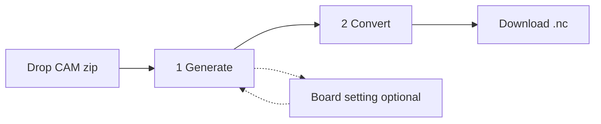

# PCB Gerber-to-G-code — Student classroom app

**Version:** 1.0.0  
**Release:** `main` (`v1.0.0`)

This file is the rebuild spec. An agent (or developer) should be able to recreate this classroom app from a blank folder by following it. Implement behavior as written; do not add `main`-only stages or extra Generate controls.

Inspired by [Carbide Copper](https://copper.carbide3d.com/), with a shorter zip → path → G-code path for a class.

---

## How to rebuild from this plan

1. Create the repo tree and files listed under **Repository layout**.
2. Install Python deps from **Tech stack**.
3. Implement backend models, services, and FastAPI routes.
4. Implement the static frontend (one HTML file + ES modules).
5. Add launchers, samples, and tests.
6. Stop when **Success criteria** pass. Do not restore the four-stage `main` workflow.

**Out of this student cut (keep on `main`):** required Machine stage in the Next-step flow; outline tab-offset slider in the UI; extra isolation/strategy knobs beyond Contour/Pocket and engraving passes.

The backend may still accept `tab_offset` on `OutlineOp` (default `0`). The student UI must not show that control.

---

## Goal

A local web app that turns a **single-sided** PCB CAM zip (Gerber RS-274X + Excellon) into millable GRBL `.nc` files without teaching every CAM strategy.

Students: drop a zip → accept (or lightly edit) classroom defaults while CNC paths overlay the board → Convert → download `.nc`.

---

## Classroom workflow

1. Start the app (`Start PCB2CNC.command` / `.bat`, or uvicorn on port 8000).
2. Drop a CAM `.zip` on **Drop CAM zip here** above Generate CNC path.
3. **Generate** — zip drop sits above the settings. CNC path preview is on the left, with the uploaded file list under the board. Isolation, drilling, and outline use classroom defaults. Choosing copper **bottom** turns **Mirror** on (paths flip around the board center). Paths overlay automatically.
4. **Convert** — inspect mill order or G-code, download `all.nc` (and per-process files).

Open **Board setting** from Generate only to change stock size, depths, Safe Z / retract, or the tool library.



---

## Repository layout

```
PCB2CNC/
  Plan.md
  README.md
  CHANGELOG.md
  .gitignore
  Start PCB2CNC.command
  Start PCB2CNC.bat
  scripts/start_server.py
  samples/
    TEST_Gerber_Simple.zip
    TEST_Gerber_Complex.zip
    PAEN_TOOLS.tlslibrary
  frontend/
    index.html
    src/app.js
    src/generate.js
    src/output.js
    src/preview.js
    src/settings.js
    src/tools.js
    src/upload.js
  backend/
    requirements.txt
    app/__init__.py
    app/main.py
    app/models.py
    app/services/__init__.py
    app/services/zip_ingest.py
    app/services/parser.py
    app/services/preview.py
    app/services/tool_library.py
    app/services/toolpath.py
    app/services/postprocess.py
    tests/test_pipeline.py
    tests/test_generate_plan.py
    tests/test_gcode_travel.py
    tests/test_tool_library.py
  data/jobs/          # created at runtime; gitignored
```

`.gitignore` must include `data/jobs/`, `__pycache__/`, `*.pyc`, `.pytest_cache/`, `.venv/`, `*.png`, `.DS_Store`.

Each job directory:

```
data/jobs/{job_id}/
  upload.zip
  files.json
  raw/                 # zip extract
  cam/                 # classified copies
  nc/                  # isolation.nc, drill.nc, outline.nc, all.nc
  nc-preview/          # path-preview NC (not downloaded)
  preview_progress.json
  preview_result.json
```

---

## Tech stack

- **Backend:** Python 3.11+ (3.14 is acceptable), FastAPI, uvicorn, pydantic v2.
- **Preview:** pygerber (Gerber raster), Pillow, OpenCV (`opencv-python-headless`), numpy.
- **Frontend:** static HTML + vanilla ES modules. No bundler. Cache-bust `index.html` script as `/src/app.js?v=1.0.0` (or bump when JS changes).
- **Optional CAM:** [pcb2gcode](https://github.com/pcb2gcode/pcb2gcode) on `PATH`. Student Convert always sends a `GeneratePlan`, so the builtin OpenCV planner is the classroom path. Without a plan, generate may use pcb2gcode then fall back to builtin.
- **Tools:** PAEN binary `.tlslibrary`. Search order: `samples/PAEN_TOOLS.tlslibrary`, repo-root `PAEN_TOOLS.tlslibrary`, `backend/data/`, `data/`. Cutting feeds use the **PCB** material row only.

`backend/requirements.txt`:

```
fastapi>=0.110
uvicorn>=0.27
python-multipart>=0.0.9
pygerber[svg]>=2.4
pillow>=10.0
numpy>=1.26
opencv-python-headless>=4.8
pytest>=8.0
httpx>=0.27
drawsvg>=2.4
```

---

## UI specification

### Chrome

- Title: **Gerber CNC**. Subtitle: `v1.0.0 · Zip in → CNC paths → G-code out`.
- Header pills: **1 Generate** (active on load) and **2 Convert**. Hidden leftover pills for Machine / extra Generate must not appear.
- **Reset** (disabled until a job exists) and green **Next step**. On Generate the button reads **Next step · Convert**. On Convert it reads **Download** and clicks the `all.nc` download (else the first file).
- Global status bar under the header (`Waiting for zip…`) plus a determinate progress bar for preview/generate.

Visual tokens (dark classroom UI): background `#0b1220` / `#121a2b`, text `#e8eef9`, muted `#93a0b8`, accent `#f5a623`, accent2 `#38bdf8`. Font: DM Sans + JetBrains Mono (Google Fonts).

### Stage 1 — Generate

`body.view-generate`. Two columns: `minmax(0, 1fr)` preview | `minmax(20rem, 32.5rem)` generate wrap. Hide Input and Layers panels.

**Left — `#panel-preview`**

- Heading: `CNC path · copper + drill + outline`.
- Fit / Zoom + / Zoom −. **Hide rapids** switch (on by default) appears once path overlays exist; hides G0 travel on the canvas.
- Canvas `#board-canvas`: pan/zoom, Gerber rasters, then copper/drill/outline path overlays colored by tool.
- File table `#preview-files` under the canvas (hidden until a zip is loaded; hidden on Convert). Columns **File** / **Kind**.

**Right — `#panel-generate-wrap`**

1. Dropzone **Drop CAM zip here** / `or click to choose · Gerber + Excellon`.
2. Heading **Generate CNC path**. Lede: classroom defaults live in a **Board setting** link.
3. **Mirror** switch: on when copper Layer is bottom, off for top. Flips copper, drill, and outline in X around the profile center. Gerber, overlays, and Convert G-code all follow it.
4. Card **1 · PCB copper trace engraving**
   - Layer select (prefer `copper_top`). Changing Layer shows that Gerber (profile stays on).
   - Strategy: **Contour** (default) or **Pocket**.
   - **Engraving passes** (1–12, default **3**) visible only for Contour. Extra passes offset farther out using the tool’s PCB step-over.
   - Tool and engrave depth are not on this card (Board setting).
5. Card **2 · PCB drilling** (one card per drill group; usually one). Hole table: Ø, count, **Corn** mill select, **Drill** / **Pocket** radios. Default mill = nearest Corn tip to hole Ø (else T4). Default strategy = plunge if hole fits the tip (±0.05 mm), else pocket.
6. Card **3 · Board outline cut** — profile layer, holding tabs (default 4), tab width (default 2 mm). Outline tool is hidden; it is the **largest Corn mill selected in drilling**. Tab offset is 0. No drag handles.

Changing copper, drill, outline, or Mirror **clears all overlays immediately**, then rebuilds copper + drill + outline after 250 ms. Manual Preview buttons still exist on cards.

**Next step · Convert** POSTs `/api/jobs/{id}/generate` with current settings + plan, then opens Convert.

Narrow screens (`max-width: 1200px`): stack preview above the form; preview height `min(70vh, 36rem)`.

### Optional — Board setting

Opened from the Generate lede. Full-width machine layout (not a header stage).

- Stock: width **100 mm**, length **150 mm**.
- Copper tool (default **T2**), engraving depth **0.2 mm**.
- Shared drill + cutout depth **1.7 mm**.
- Outline cut tool shown **disabled**; follows largest Corn mill from drilling.
- Safe Clearance Height **15 mm**, Safe Retract Height **3 mm**.
- PAEN tool table (PCB rows), upload library, reload, tool properties.
- Sticky **Cancel** (restore snapshot, return to Generate) and **Apply** (save, return; rebuild path previews if depths/tools changed).

### Stage 2 — Convert

`body.view-convert`. Three columns ~50% / 30% / 20%: preview | Inspect | Convert G-code.

- Preview keeps the same canvas and Hide rapids. File table hidden.
- Inspect: **Job list** (default) vs **G-code**. Job list shows mill order (`#`, Job, Tool). Tool change is its own wait step. `T0 M6` (Return Tool) is not a mill-order row. G-code shows the selected file as monospace text.
- Convert: list `all.nc`, `isolation.nc`, `drill.nc`, `outline.nc` with **Download**. Selecting a row inspects that file.

---

## Frontend modules

| File | Responsibility |
| --- | --- |
| `index.html` | Markup, CSS, stage layout |
| `src/app.js` | Stages, zip upload, Next/Reset, Convert inspect, canvas overlays |
| `src/generate.js` | Generate form, plan JSON, auto path preview, drill table defaults |
| `src/output.js` | `generate` / `preview-path` fetch, mill-order parse, download list |
| `src/preview.js` | Canvas pan/zoom, Gerber + path drawing, Hide rapids |
| `src/settings.js` | Board-setting form read/snapshot/restore |
| `src/tools.js` | `/api/machine/tools` load/upload, PCB cuts for selected tool |
| `src/upload.js` | Dropzone + `POST /api/jobs/upload` |

`readGeneratePlan` sends one `copper` op (the selected top or bottom layer — not `copper_bottom`), drills, outline, and `mirror`. Output is always `isolation.nc`. Copper `isolation_passes` default 3. Outline `tab_offset` is always 0 from the student UI.

After zip upload, the UI starts preview with `POST /preview/start` and polls `GET /preview/progress` until `result` is ready. Then it mounts the Generate form and runs `autoPreviewAll()`.

---

## Backend

Serve `frontend/` last with `Cache-Control: no-store`. CORS allow all (local classroom). FastAPI title `Gerber CNC GUI`, version `1.0.0`.

### API

| Method | Path | Purpose |
| --- | --- | --- |
| GET | `/api/health` | `{ ok, pcb2gcode }` |
| GET | `/api/machine/tools` | PAEN tools (PCB cuts) |
| POST | `/api/machine/tools/upload` | Replace library file |
| POST | `/api/jobs/upload` | CAM `.zip` → `job_id` + classified files |
| GET | `/api/jobs/{id}/preview` | Layer PNGs + drills + bounds |
| POST | `/api/jobs/{id}/preview/start` | Async preview |
| GET | `/api/jobs/{id}/preview/progress` | Preview progress |
| POST | `/api/jobs/{id}/preview-path` | One (or planned) operation into `nc-preview/`, return overlay paths |
| POST | `/api/jobs/{id}/generate` | Write `nc/*.nc` + overlay paths |
| GET | `/api/jobs/{id}/nc` | List `.nc` names |
| GET | `/api/jobs/{id}/nc/{file}` | Download; **must** run `ensure_program_end` before serving |
| GET | `/api/jobs/{id}/toolpath-preview` | Optional verification PNG |

### Models (`app/models.py`) defaults

`MachineSettings`: tool 2, board 100×150 mm, engrave **0.2 mm**, drill **1.7 mm**, spindle 12000, feed 2000, plunge 200, step-over 50%, step-down 0.1 mm, safe Z **15 mm**, retract **3 mm**, coolant true.

`CopperOp`: tool 2, `isolation_passes` **3** (1–12), `engrave_mode` contour|pocket.

`DrillSizeMap`: tool 4, strategy drill|pocket.

`OutlineOp`: tool 4, tab_count 4, tab_width 2 mm, tab_offset 0.

`GeneratePlan`: optional copper, copper_bottom, drills[], outline, mirror bool.

Engrave depth must not exceed drill depth.

### Zip ingest

Unpack to `data/jobs/{id}/` as `upload.zip` + `raw/` + classified copies in `cam/`. Skip `__MACOSX`, `._*` AppleDouble (including `00 05 16 07` payloads), `.gbrjob`, pick-and-place, assembly BOM `.txt`.

Classify by filename:

- copper_top / copper_bottom / profile / soldermask_* / silkscreen_* / solderpaste_* / drill / gerber_other.

Extensions: Gerber `.gbr .ger .gtl .gbl .gts .gbs .gto .gbo .gko .gm1 .pho`; drill `.xln .drl .exc`.

Require at least one copper layer. If there is no `copper_top`, reclassify the first `copper_bottom` as `copper_top` (single-sided MVP).

### Preview

Raster each Gerber with pygerber; overlay Excellon hits grouped by Ø. Return PNG base64 per layer plus combined bounds. Default visibility: `copper_top` on, `copper_bottom` off, profile on. Student UI uses the async start/progress endpoints, not the sync `GET /preview`.

### Toolpath (builtin, student plan)

When `plan` is present, always use builtin (not pcb2gcode).

1. **Copper contour** — raster copper, offset tool-center contours: first offset = tip/2, further passes add `tip * (step-over%/100)` in px at 50 dpmm. One Z pass: step-down ≥ engrave depth.
2. **Copper pocket** — clear unused copper inside the outline, leave traces.
3. **Drill** — group by (tool, Ø, strategy). Drill = plunge. Pocket = concentric circles with the Corn mill. Nearest-neighbor hit order. Retract between nearby holes; Safe Z for hops ≥ **40 mm** or group boundaries.
4. **Outline** — longest outside contour, cutter-radius compensation, split with tabs (offset 0). Multi-pass step-down from the outline tool. Do not G1 across an open tab gap; each pass re-enters at the segment start.
5. **Mirror** — X-flip all paths/hits about the profile center.

After writing files, merge into `all.nc`. Then `ensure_program_end` on every produced `.nc`.

Without a plan: pcb2gcode if available, else the simple builtin generator; still merge + ensure program end.

Path preview uses the same planner into `nc-preview/` **without** merging `all.nc`.

### G-code postprocessor

Header:

```
%
; {operation title}
; Material: PCB
; Board: {W} x {L} mm
; Drill depth: {d} mm
; Clearance height: {safe_z} mm
; Retract height: {retract_z} mm
G90 G21
G17
T{n} M6
S{rpm} M3
M8   (or "; coolant disabled")
G0 Z{safe_z}
```

Travel: nearby XY hops stay at retract Z; hops ≥ 40 mm lift to Safe Z. Nearest-neighbor contour/hit order; rotate closed paths so the start is nearest the approach.

**Every standalone `.nc` must end with Return Tool then Home:**

```
G0 Z{safe_z}
M9
M5
; Return Tool
T0 M6
; Home position
G28
M2
```

`all.nc` strips each part’s program start/end so Return Tool / Home run **once** at the end of the merged job. Insert `; Job sequence` / `; SEQ n | … | T{n}` comments. Skip `T0` when building mill-order rows.

`ensure_program_end(path)` appends that epilogue if `; Return Tool`, `T0 M6`, `; Home position`, and `G28` are missing. Download endpoint always calls it so older jobs still download a complete ending.

---

## Machine tools (PAEN, PCB material only)

| Number | Name | Type | Tip | PCB spindle | Step over | Step down | Feed | Plunge | Coolant |
| --- | --- | --- | --- | --- | --- | --- | --- | --- | --- |
| 1 | 0.3mm*30° Solder Mask Removal | Engraving | 0.3 | 6000 | 66.667 | 0.2 | 400 | 200 | Y |
| 2 | 0.2mm*30° Engraving (Metal) | Engraving | 0.2 | 12000 | 50 | 0.1 | 2000 | 200 | Y |
| 3 | 0.8mm Corn | Flat End | 0.8 | 12000 | 60 | 0.3 | 500 | 300 | N |
| 4 | 1mm Corn | Flat End | 1.0 | 12000 | 60 | 0.3 | 500 | 300 | N |
| 5 | 1.5mm Corn | Flat End | 1.5 | 12000 | 60 | 0.3 | 500 | 300 | N |
| 6 | 2mm Corn | Flat End | 2.0 | 12000 | 60 | 0.3 | 500 | 300 | N |

Ignore copper/aluminum/wood and other non-PCB rows. Default engraving tool **#2**; default outline / large-hole **#4**. If the library is missing, Board setting shows: `PAEN_TOOLS.tlslibrary not found. Place it in samples/ or use Upload library.` Uploads save to `samples/PAEN_TOOLS.tlslibrary`.

---

## Launchers

`Start PCB2CNC.command` (macOS) and `Start PCB2CNC.bat` (Windows) run `scripts/start_server.py`.

The script creates `.venv` if needed, `pip install -r backend/requirements.txt`, then:

```
uvicorn app.main:app --host 0.0.0.0 --port 8000 --reload
```

with `PYTHONPATH` = `backend/`. Opens http://127.0.0.1:8000 when healthy. If port 8000 already serves this app, only open the browser.

`--reload` is required so Python edits apply without a manual restart.

---

## Tests

From `backend/`:

```bash
PYTHONPATH=. python3 -m pytest -q
```

Must cover:

- Zip ingest skips AppleDouble; upload → preview → generate writes NC (`test_pipeline.py`).
- Generate plan: tabs, isolation offsets, mill-order comments, mirror, contour vs pocket (`test_generate_plan.py`).
- Travel: retract vs Safe Z, nearest-neighbor, single copper Z pass; **Return Tool then Home** on writers; `ensure_program_end` patches legacy files that only had `M5`/`M2`; merged `all.nc` has Return/Home **once** (`test_gcode_travel.py`).
- Tool library PCB-row parse (`test_tool_library.py`).

---

## CNC safety

- Clearance and retract between operations; short hops at retract; Safe Z for long hops, tool changes, program start/end.
- Copper engrave depth ≤ drill depth.
- Clamp feed / plunge / RPM from the selected tool’s PCB row.
- Coolant from that row (`Y`/`N`).
- Outline must not G1 across an open tab gap.
- Path ordering must not change cut geometry — only visit order and Z clearance.
- After the last cut: return tool (`T0 M6`) then home (`G28`) then `M2`.

---

## Success criteria

Rebuild is done when all of the following hold:

1. Double-click launcher (or uvicorn) serves the UI at http://127.0.0.1:8000.
2. Drop `samples/TEST_Gerber_Simple.zip`: file table lists CAM files; copper prefers top; Contour + 3 passes; drill table has Corn mills and Drill/Pocket; outline tabs 4 × 2 mm; paths overlay without clicking Preview on each card.
3. Copper bottom turns Mirror on; overlays and G-code X-flip around the board center.
4. Changing copper/drill/outline/Mirror clears overlays, then rebuilds all three paths.
5. Board setting is optional; Apply/Cancel return to Generate; six PAEN tools load from `samples/PAEN_TOOLS.tlslibrary`.
6. Next step · Convert writes `isolation.nc`, `drill.nc`, `outline.nc`, `all.nc`.
7. Every downloaded `.nc` ends with `; Return Tool`, `T0 M6`, `; Home position`, `G28`, `M2`. `all.nc` does that once at the very end.
8. Inspect Job list and G-code; Download works.
9. `pytest` in `backend/` passes (skip only missing optional sample paths).
