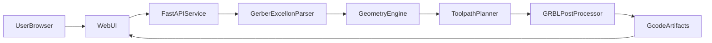

# PCB Gerber-to-G-code MVP Plan

## Goal

Create a local web-based workflow (inspired by [Carbide Copper](https://copper.carbide3d.com/)) to convert single-sided PCB files into CNC milling/drilling G-code with straightforward machine/tool configuration.

## Scope (MVP)

- Single-sided PCB job flow only (Top side only).
- Inputs:
  - Gerber RS-274X signal layer.
  - Excellon drill file.
  - Optional board outline Gerber.
- User-configurable machining parameters:
  - Material dimensions (X/Y/Z).
  - Origin position.
  - Tool diameter, spindle RPM, feed/plunge rates, cut depth.
  - Isolation pass count.
  - Operation-to-tool mapping with automatic tool changes.
- Default engraving operation setup:
  - Tool number: `2`
  - Tool type: `0.2mm x 30 degree` engraving bit (V-bit)
  - Engraving depth: `0.15mm` from PCB top surface
  - Spindle speed: `12000` RPM
  - Step over: `50%`
  - Step down: `0.1mm`
  - Feed rate: `2000 mm/min`
  - Plunge rate: `200 mm/min`
  - Coolant: `enabled`
- Outputs:
  - One merged `.nc`/`.gcode` file.
  - Optional separate files by operation (contour/isolation, drill, outline).

## User Workflow (Gerber First)

1. Upload PCB Gerber layout file first.
2. Render and preview the Gerber layout on canvas (zoom, pan, fit-to-view).
3. Validate Gerber file parse success and show clear errors if invalid.
4. Upload Excellon drill file and align to Gerber coordinates.
5. Optionally upload board outline file.
6. Configure tool and machine parameters.
  - Pre-fill engraving operation with Tool #2 and 0.15mm depth.
7. Generate and download G-code (single or split files).

## Proposed Architecture

## Technical Approach

- Backend: Python + FastAPI.
- Frontend: lightweight HTML/JS first (upgradeable later).
- Geometry/processing pipeline:
  1. Parse Gerber into normalized geometry and preview payload.
  2. Parse Excellon into drill hits.
  3. Generate isolation contours from copper primitives using tool diameter + pass-count offset logic.
  4. Convert drill hits into drill toolpaths.
  5. Optionally route board outline.
  6. Post-process to GRBL-compatible G-code with safe Z moves, spindle commands, unit mode, and automatic tool-change commands by operation.
- Preview requirements:
  - Gerber layer visible immediately after upload.
  - Drill/outline overlays can be toggled after those files are loaded.
  - Coordinate system and board extents shown for user confidence before generation.
  - Show calculated pass settings (step over/step down) and estimated pass count for engraving.

## MVP Milestones

1. **Foundation & Data Model**
  - Define job schema for uploads + machine params.
  - Define operation schema (isolation/drill/outline).
2. **Gerber Upload + Preview First**
  - Implement Gerber upload endpoint and parsing.
  - Implement preview API response and frontend canvas rendering.
  - Add parse/error handling UX.
3. **Parsing Layer Completion**
  - Add Excellon parser integration.
  - Add optional outline parser integration.
4. **Toolpath Generation**
  - Isolation contour pass generation.
  - Drill path generation.
  - Optional outline pass generation.
5. **Post Processor**
  - GRBL output generator.
  - Emit tool-change instructions per operation (e.g., engraving, drilling, outline) for auto tool changer workflows.
  - Single-file merge and optional split-file output.
6. **Verification**
  - Golden sample test fixtures (known Gerber+Excellon to expected path checks).
  - Dry-run checks in CAM simulator.

## Recommended Project Structure

- `backend/`
  - `app/main.py` (FastAPI entry)
  - `app/models.py` (request/response schemas)
  - `app/services/parser.py`
  - `app/services/preview.py`
  - `app/services/toolpath.py`
  - `app/services/postprocess.py`
  - `app/services/estimate.py`
  - `tests/`
- `frontend/`
  - `index.html`
  - `src/upload.js`
  - `src/preview.js`
  - `src/settings.js`
  - `src/output.js`
- `samples/`
  - reference Gerber/Excellon fixtures for regression tests

## CNC Safety & Reliability Guardrails

- Enforce configurable `safe_z` and retract between operations.
- Validate max depth against material thickness.
- Clamp feed/plunge/RPM to machine-safe ranges.
- Add a machine profile preset system (start with one profile, extensible later).
- Validate tool assignments before generation and ensure Tool #2 engraving defaults are present unless explicitly changed by user.
- Validate coolant command compatibility with selected controller profile and emit proper coolant on/off commands.

## Risks and Mitigations

- **Gerber format edge cases**: start with strict RS-274X subset + clear error messages.
- **Geometry robustness**: use proven geometry libraries and keep operations deterministic.
- **Machine differences**: isolate postprocessor settings in profile config.
- **Preview mismatch risk**: use the same normalized geometry source for preview and toolpath generation.

## Deliverables

- Working local web app for single-sided PCB to G-code conversion.
- Gerber-first guided UX with immediate layout preview.
- Downloadable `.nc` output for CNC controller.
- Basic test suite and sample fixtures.
- User README for expected input files and safe machine setup.

## Success Criteria

- User can upload Gerber first and visually confirm the board layout within 10 seconds.
- User can upload drill file, configure parameters, and export valid G-code in under 3 minutes.
- Output runs in simulator without syntax/path errors.
- At least 3 sample boards generate repeatable, deterministic output.

