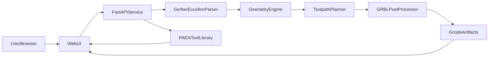

# PCB Gerber-to-G-code MVP Plan

## Goal

Create a local web-based workflow (inspired by [Carbide Copper](https://copper.carbide3d.com/)) to convert single-sided PCB files into CNC milling/drilling G-code with straightforward machine/tool configuration.

## Delivery stages

### Stage 1 — Colored Gerber + drill preview
- Drag-drop a CAM `.zip` (Gerber RS-274X + Excellon).
- Classify layers (copper, profile, mask, silk, drill).
- Render multi-layer canvas preview with distinct colors and toggles.
- Overlay Excellon drill hits (not finished machine G-code).

### Stage 2 — Machine setup
- Load `PAEN_TOOLS.tlslibrary` (binary PAEN format) and show a compact tool list.
- Job-wide settings only: copper engrave depth, drill depth, safe Z.
- Per-tool PCB cutting values come from the library, not the settings form.

### Stage 3 — Generate CNC G-code + verification graphic
- Generate isolation / drill / outline `.nc` from a per-process plan (not a single global tool).
- Use `pcb2gcode` when installed; otherwise the built-in contour generator.
- Feeds, spindle, step-over, and step-down come from each selected tool’s PCB row.
- Overlay colored toolpaths on the Stage 1 board preview (Preview on each process card).
- Convert (Stage 4) writes the downloadable `.nc` files from this plan.

**1 · Copper trace engraving**
- Strategy: **contour** (isolation around copper) or **pocket** (clear unused copper inside a board outline, leaving traces).
- Fields, top to bottom: Strategy, Layer, Board outline (pocket only), Tool (default T2), Engraving depth (default `0.15 mm`), Isolation passes (contour only).
- Extra contour passes step farther out using the tool’s step-over.

**2 · PCB drilling**
- Drill depth (default `1.6 mm`) and one or more Excellon files.
- Table: hole Ø, count, tool (nearest tip by default), strategy **drill** or **pocket**.
- Drill: single plunge. Pocket: mill concentric circles so a smaller corn mill can open a hole larger than the tool. Falls back to a plunge if the hole is not larger than the tip.
- Preview colours follow the assigned tool.

**3 · Board outline cut**
- Outside compensation: tool center is offset by the cutter radius so the cut edge follows the outline.
- Fields: Outline layer, Tool (default T4), Cutout depth (default `1.6 mm`), holding-tab count and width.
- **Tab offset** (0–100% around the perimeter) rotates the evenly spaced tabs. Preview pan/zoom only — no drag handles on the board.

Generate is a right-hand settings column; the board preview stays on the left.

### Stage 4 — Convert
- **Next step · Convert** writes `isolation.nc`, `drill.nc`, `outline.nc`, and merged `all.nc` from the Stage 3 plan.
- Convert is three columns: board preview (50%), mill-order / G-code inspect (30%), then `.nc` file downloads (20%).
- The middle pane switches between the job list and the selected file’s G-code.

## Scope (current)

- Single-sided PCB job flow only (Top side only).
- Inputs:
  - Gerber RS-274X signal layer (from zip).
  - Excellon drill file.
  - Optional board outline Gerber.
  - PAEN tool library (`PAEN_TOOLS.tlslibrary`) for machine tools.
- Job-wide machining parameters:
  - Copper engrave depth: `0.15 mm` (default).
  - Drill depth: `1.6 mm` (default; also used for outline through-cut).
  - Safe Z: `15 mm` (default).
- Per-tool PCB properties (from the library, PCB material only):
  - Spindle speed, step over, step down, feed rate, plunge rate, coolant.
- Default selected tool: `#2` `0.2mm*30° Engraving (Metal)`.
- Outputs:
  - One merged `.nc` file (`all.nc`).
  - Optional separate files by operation (`isolation.nc`, `drill.nc`, `outline.nc`).

## Machine tools (PAEN library, PCB material)

| Number | Name | Type | Tip | PCB spindle | Step over | Step down | Feed | Plunge | Coolant |
| --- | --- | --- | --- | --- | --- | --- | --- | --- | --- |
| 1 | 0.3mm*30° Solder Mask Removal | Engraving | 0.3 | 6000 | 66.667 | 0.2 | 400 | 200 | Y |
| 2 | 0.2mm*30° Engraving (Metal) | Engraving | 0.2 | 12000 | 50 | 0.1 | 2000 | 200 | Y |
| 3 | 0.8mm Corn | Flat End | 0.8 | 12000 | 60 | 0.3 | 500 | 300 | N |
| 4 | 1mm Corn | Flat End | 1.0 | 12000 | 60 | 0.3 | 500 | 300 | N |
| 5 | 1.5mm Corn | Flat End | 1.5 | 12000 | 60 | 0.3 | 500 | 300 | N |
| 6 | 2mm Corn | Flat End | 2.0 | 12000 | 60 | 0.3 | 500 | 300 | N |

Other library materials (copper, aluminum, wood, etc.) are ignored.

## User Workflow

1. Drag-drop PCB CAM zip (Gerber + drill).
2. Render and preview layers on canvas (zoom, pan, fit-to-view, color toggles).
3. Open Machine: pick a tool from the 5-column list (Number, Name, Type, Diameter, Tip Diameter).
4. Remaining geometry and PCB cutting values appear in **Tool properties** below the table.
5. Confirm copper engrave depth, drill depth, and safe Z.
6. Generate: assign layer/tool/strategy per process, Preview on the board, then convert and download `.nc`.

## Proposed Architecture

## Technical Approach

- Backend: Python + FastAPI (`backend/app`).
- Frontend: lightweight HTML/JS (`frontend/`).
- Preview: **pygerber** raster layers + Excellon hole overlay.
- CAM: **pcb2gcode** CLI when present; otherwise builtin OpenCV contour toolpaths.
- Tool library: parse PAEN binary `.tlslibrary` (UTF-16-BE length-prefixed records) and keep PCB cutting params only.
- Geometry/processing pipeline:
  1. Parse Gerber into preview rasters + bounds.
  2. Parse Excellon into drill hits.
  3. Generate isolation (contour or pocket), drill (plunge or hole-pocket), and outside outline with holding tabs.
  4. Post-process to GRBL-compatible G-code with safe Z, selected-tool spindle/coolant, and tool changes.
- Preview requirements:
  - Gerber layers visible immediately after upload.
  - Drill overlay toggleable.
  - Coordinate extents shown before generation.
  - Per-process toolpath overlay on the board canvas during Generate (Preview on).
  - Toolpath verification graphic after Convert.

## Project Structure

- `backend/`
  - `app/main.py` (FastAPI entry)
  - `app/models.py` (request/response schemas)
  - `app/services/zip_ingest.py`
  - `app/services/parser.py`
  - `app/services/preview.py`
  - `app/services/toolpath.py`
  - `app/services/postprocess.py`
  - `app/services/tool_library.py`
  - `tests/`
- `frontend/`
  - `index.html`
  - `src/upload.js`
  - `src/preview.js`
  - `src/settings.js`
  - `src/tools.js`
  - `src/generate.js`
  - `src/output.js`
  - `src/app.js`
- `PAEN_TOOLS.tlslibrary` — machine tool library (geometry + PCB properties)
- `samples/` — Gerber zip fixtures
- `data/jobs/` — runtime upload workspace

## CNC Safety & Reliability Guardrails

- Enforce configurable `safe_z` and retract between operations.
- Copper engrave depth must not exceed drill depth.
- Clamp feed/plunge/RPM from the selected tool to machine-safe ranges.
- Emit coolant from the selected tool’s PCB property (`Y`/`N`).

## Risks and Mitigations

- **Gerber format edge cases**: start with RS-274X via pygerber + clear error messages.
- **pcb2gcode missing**: automatic fallback to builtin generator.
- **Preview mismatch risk**: same job CAM files feed preview and generation.
- **PAEN library format**: scan GUID-prefixed tool records and skip 3D mesh blobs.

## Success Criteria

- Stage 1: Dropping a sample Gerber zip shows copper + profile + drills with colors.
- Stage 2: Machine step lists the six PAEN tools; selecting one shows PCB properties.
- Stage 3: Generate writes `isolation.nc`, `drill.nc`, `outline.nc`, and `all.nc` from the per-process plan (contour/pocket copper, drill/pocket holes, outline tabs + offset).
- Stage 4: One session completes zip → preview → machine → generate → download.
