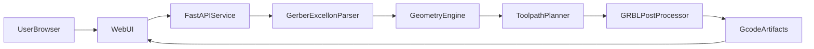

# PCB Gerber-to-G-code MVP Plan

## Goal

Create a local web-based workflow (inspired by [Carbide Copper](https://copper.carbide3d.com/)) to convert single-sided PCB files into CNC milling/drilling G-code with straightforward machine/tool configuration.

## Delivery stages

### Stage 1 — Colored Gerber + drill preview
- Drag-drop a CAM `.zip` (Gerber RS-274X + Excellon).
- Classify layers (copper, profile, mask, silk, drill).
- Render multi-layer canvas preview with distinct colors and toggles.
- Overlay Excellon drill hits (not finished machine G-code).

### Stage 2 — Generate CNC G-code + verification graphic
- Generate isolation / drill / outline `.nc` from the loaded job.
- Use `pcb2gcode` when installed; otherwise the built-in contour generator.
- Show a colored toolpath verification image.
- Download split and merged `.nc` files.

### Stage 3 — Combined convert workflow
- One UI: zip → preview → machine settings → generate → verify → download.
- Minimal settings: engrave depth, feed, spindle, safe Z, stock thickness.
- Plan.md default engraving tool (#2, 0.15 mm depth, 12000 RPM, etc.).

## Scope (MVP)

- Single-sided PCB job flow only (Top side only).
- Inputs:
  - Gerber RS-274X signal layer (from zip).
  - Excellon drill file.
  - Optional board outline Gerber.
- User-configurable machining parameters (Stage 3 minimal set + defaults):
  - Material / stock thickness.
  - Tool diameter context via generator defaults.
  - Spindle RPM, feed/plunge rates, cut depth, safe Z.
  - Coolant enabled by default.
- Default engraving operation setup:
  - Tool number: `2`
  - Tool type: `0.2mm x 30 degree` engraving bit (V-bit)
  - Engraving depth: `0.15mm` from PCB top surface
  - Spindle speed: `12000` RPM
  - Step over: `50%`
  - Step down: `0.1mm`
  - Feed rate: `2000 mm/min`
  - Plunge rate: `200 mm/min`
  - Coolant: `enabled`
- Outputs:
  - One merged `.nc`/`.gcode` file (`all.nc`).
  - Optional separate files by operation (`isolation.nc`, `drill.nc`, `outline.nc`).

## User Workflow

1. Drag-drop PCB CAM zip (Gerber + drill).
2. Render and preview layers on canvas (zoom, pan, fit-to-view, color toggles).
3. Validate parse success and show clear errors if invalid.
4. Confirm machine parameters (defaults pre-filled).
5. Generate G-code and inspect verification graphic.
6. Download merged and/or split `.nc` files.

## Proposed Architecture

## Technical Approach

- Backend: Python + FastAPI (`backend/app`).
- Frontend: lightweight HTML/JS (`frontend/`).
- Preview: **pygerber** raster layers + Excellon hole overlay.
- CAM: **pcb2gcode** CLI when present; otherwise builtin OpenCV contour toolpaths.
- Geometry/processing pipeline:
  1. Parse Gerber into preview rasters + bounds.
  2. Parse Excellon into drill hits.
  3. Generate isolation / outline contours and drill cycles.
  4. Post-process to GRBL-compatible G-code with safe Z, spindle, coolant, tool changes.
- Preview requirements:
  - Gerber layers visible immediately after upload.
  - Drill overlay toggleable.
  - Coordinate extents shown before generation.
  - Toolpath verification graphic after generation.

## Project Structure

- `backend/`
  - `app/main.py` (FastAPI entry)
  - `app/models.py` (request/response schemas)
  - `app/services/zip_ingest.py`
  - `app/services/parser.py`
  - `app/services/preview.py`
  - `app/services/toolpath.py`
  - `app/services/postprocess.py`
  - `tests/`
- `frontend/`
  - `index.html`
  - `src/upload.js`
  - `src/preview.js`
  - `src/settings.js`
  - `src/output.js`
  - `src/app.js`
- `samples/` — `TEST_Gerber.zip`, `CAMOutputs/`, reference `nc_files/`
- `data/jobs/` — runtime upload workspace

## CNC Safety & Reliability Guardrails

- Enforce configurable `safe_z` and retract between operations.
- Validate max depth against material thickness.
- Clamp feed/plunge/RPM to machine-safe ranges.
- Validate coolant command emission for the controller profile.

## Risks and Mitigations

- **Gerber format edge cases**: start with RS-274X via pygerber + clear error messages.
- **pcb2gcode missing**: automatic fallback to builtin generator.
- **Preview mismatch risk**: same job CAM files feed preview and generation.

## Success Criteria

- Stage 1: Dropping `samples/TEST_Gerber.zip` shows copper + profile + drills with colors.
- Stage 2: Generate produces non-empty `.nc` plus verification PNG.
- Stage 3: One session completes zip → preview → generate → download.
