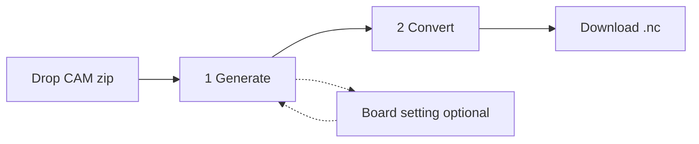
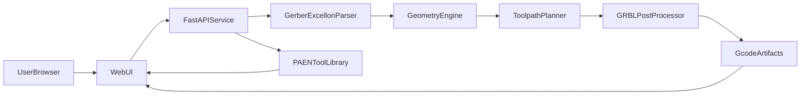

# PCB Gerber-to-G-code — Student version

**Branch:** `student-version`  
**Base:** `main` at 0.4.3  
**Version:** 0.4.3-student

A trimmed classroom build of the Gerber CNC app. Students convert a CAM zip into millable G-code in two steps. Advanced Generate choices stay on `main`.

## Goal

Give a class a local web app that turns a single-sided PCB CAM zip into CNC G-code without teaching every CAM strategy. Drop a zip, accept (or lightly edit) defaults while the CNC path overlay is on the board, convert, download `.nc`.

Inspired by [Carbide Copper](https://copper.carbide3d.com/), but with a shorter path from zip to mill.

## What this branch changes vs `main`

| Area | `main` | `student-version` |
| --- | --- | --- |
| Stages in the header | 1 Preview · 2 Machine · 3 Generate · 4 Convert | 1 Generate · 2 Convert |
| Board setting | Required next step | Optional link on Generate |
| Copper strategy | Contour or pocket, extra isolation passes | Contour or pocket; engraving passes on contour |
| Default copper layer | First copper in the zip (often bottom) | Prefer `copper_top` |
| Drill strategy | Per-size Drill / Pocket radios | Per-size Drill / Pocket radios (default follows hole vs tip) |
| Outline tabs | Count, width, and tab-offset slider | Count and width only; offset fixed at 0 |
| Path preview | Click Preview on each process card | Copper, drill, and outline preview automatically |
| Convert | Same mill-order inspect + downloads | Unchanged |

Backend still accepts tab offset if a client sends it. The student UI does not offer that control.

## Classroom workflow

1. Start the app (`Start PCB2CNC.command` / `.bat`, or uvicorn on port 8000).
2. Drop a CAM `.zip` (Gerber RS-274X + Excellon) on the **Input** column.
3. **Generate** — Input stays on the left, CNC path preview (copper + drill + outline) in the middle, Generate settings on the right. Isolation, drilling, and outline use classroom defaults. Choose copper **bottom** to turn **Mirror** on (paths flip around the board center). Paths overlay on the canvas automatically.
4. **Convert** — inspect mill order or G-code, download `all.nc` (and optional per-process files).

Open **Board setting** from Generate only to change stock size, Safe Z / retract, or the tool library.

---

## Stage 1 — Generate (preview + paths)

Three columns: **Input** (left), **CNC path · copper + drill + outline** (middle), **Generate CNC path** (right).

- Drag-drop a CAM `.zip` in Input.
- Classify layers (copper, profile, mask, silk, drill).
- Canvas shows the board, then overlays isolation, drill, and outline automatically.
- Overlay Excellon drill hits, then machine paths.
- Show board extents (width × length).
- **Next step · Convert** (does not stop on Board setting).

### Generate CNC path (right column)

Feeds, spindle, step-over, and step-down come from each selected tool’s PCB row in `PAEN_TOOLS.tlslibrary`.

**Mirror** turns on automatically when copper **Layer** is bottom (and off for top). It flips copper, drill, and outline left-to-right around the profile center. Gerber, overlays, and Convert G-code all follow it.

**Hide rapids** appears once paths exist; on by default so G0 travel is hidden.

### 1 · Copper trace engraving

- Isolation **contour** around copper, or **pocket** to clear unused copper inside the board outline.
- Student fields: **Layer** (top or bottom), **Contour / Pocket**, and **Engraving passes** when Contour is selected (1–12).
- Tool (default T2) and engraving depth (default `0.2 mm`) live in **Board setting**.
- Changing Layer shows that Gerber on the canvas (profile stays on).

### 2 · PCB drilling

- Drill and outline cutout share one depth (default `1.7 mm`) in **Board setting**.
- Table: hole Ø, count, **Corn** tool only, strategy **Drill** or **Pocket**.
- Default strategy: plunge when the hole fits the tool; pocket when the hole is larger than the tip.
- Preview colours follow the assigned tool.

### 3 · Board outline cut

- Outside compensation: tool center offset by cutter radius so the cut edge follows the outline.
- Student fields: Profile layer only, holding-tab count and width.
- Tool is the **largest Corn mill selected in PCB drilling** (not a student picker). Cutout uses the same Board-setting depth as drilling.
- Tab offset is 0. No drag handles on the board.
- Each step-down pass re-enters at the current segment start (no G1 across an open tab gap).

### Optional — Board setting

- Stock: width `100 mm`, length `150 mm`.
- Copper engraving tool (default T2) and engrave depth `0.2 mm`.
- Drill and outline cutout share one depth `1.7 mm`.
- Outline cut tool is shown locked; it follows the largest Corn mill selected in PCB drilling.
- Safe Clearance Height `15 mm`, Safe Retract Height `3 mm`.
- **Apply** saves the form and returns to Generate (path previews rebuild if depths or tools changed). **Cancel** restores the previous values and returns to Generate.

## Stage 2 — Convert

- **Next step · Convert** writes `isolation.nc`, `drill.nc`, `outline.nc`, and merged `all.nc`.
- Layout: CNC path preview (~50%), mill-order / G-code inspect (~30%), file list (~20%).
- Inspect switches between **Job list** and **G-code**. A tool change is its own mill-order step.
- Download buttons are labeled **Download**.
- Hide rapids remains available.

## G-code travel (builtin postprocessor)

Same as `main`. Isolation, pocket holes, outline, and drills reduce wasted air time:

1. **Retract vs Safe Z** — Nearby hops stay at Retract Height. Lift to Clearance Height only for long XY hops, operation start/end, and tool changes.
2. **Nearest-neighbor order** — Contours and drill hits are ordered from the previous end point. Closed paths may start at the closest vertex.
3. **Single depth pass** when cut depth fits in one step-down. Copper forces step-down ≥ engrave depth so isolation finishes in one Z pass. Outline and hole-pocket keep multi-pass step-down.
4. Drill groups use retract between holes; Safe Z only for long hops or group boundaries.

## Scope

**In**

- One copper side per job (top or bottom).
- Inputs: Gerber zip, Excellon, optional outline Gerber, PAEN tool library.
- Outputs: `all.nc`, plus `isolation.nc`, `drill.nc`, `outline.nc`.
- Defaults: stock 100 × 150 mm, engrave 0.2 mm, drill 1.7 mm, outline 1.7 mm, Safe Z 15 mm, retract 3 mm.
- Default engraving tool: `#2` `0.2mm*30° Engraving (Metal)`.
- Default outline / large-hole tool: `#4` `1mm Corn`.

**Out (stay on `main`)**

- Required Machine / Board setting stage.
- Outline tab-offset slider.

## Machine tools (PAEN library, PCB material only)

| Number | Name | Type | Tip | PCB spindle | Step over | Step down | Feed | Plunge | Coolant |
| --- | --- | --- | --- | --- | --- | --- | --- | --- | --- |
| 1 | 0.3mm*30° Solder Mask Removal | Engraving | 0.3 | 6000 | 66.667 | 0.2 | 400 | 200 | Y |
| 2 | 0.2mm*30° Engraving (Metal) | Engraving | 0.2 | 12000 | 50 | 0.1 | 2000 | 200 | Y |
| 3 | 0.8mm Corn | Flat End | 0.8 | 12000 | 60 | 0.3 | 500 | 300 | N |
| 4 | 1mm Corn | Flat End | 1.0 | 12000 | 60 | 0.3 | 500 | 300 | N |
| 5 | 1.5mm Corn | Flat End | 1.5 | 12000 | 60 | 0.3 | 500 | 300 | N |
| 6 | 2mm Corn | Flat End | 2.0 | 12000 | 60 | 0.3 | 500 | 300 | N |

Other library materials (copper, aluminum, wood, etc.) are ignored.

## Architecture

- Backend: Python + FastAPI (`backend/app`).
- Frontend: HTML/JS (`frontend/`). Student UI lives mainly in `index.html`, `src/app.js`, `src/generate.js`.
- Preview: **pygerber** rasters + Excellon overlay.
- CAM: **pcb2gcode** if on `PATH`; otherwise builtin OpenCV contour toolpaths.
- Tool library: PAEN binary `.tlslibrary`; PCB cutting params only.

Pipeline: parse Gerber → parse Excellon → contour isolation + auto drill/pocket + outside outline with tabs → GRBL G-code (clearance/retract, nearest-neighbor travel, single-pass shallow copper, tool spindle/coolant, tool changes).

## CNC safety

- Configurable clearance and retract between operations.
- Short hops at Retract Height; Safe Z for long hops, tool changes, program start/end.
- Copper engrave depth must not exceed drill depth.
- Clamp feed/plunge/RPM from the selected tool.
- Coolant from the tool’s PCB property (`Y`/`N`).
- Outline must not G1 across an open tab gap.
- Path ordering must not change cut geometry — only visit order and Z clearance.

## Success criteria

- Generate: dropping `samples/TEST_Gerber_Simple.zip` shows copper, profile, and drills, then copper/drill/outline paths on the same screen; copper has Contour/Pocket and engraving passes; drill table has Drill/Pocket; choosing copper bottom turns Mirror on; paths appear without clicking Preview on each card.
- Convert: writes `isolation.nc`, `drill.nc`, `outline.nc`, and `all.nc`; mill order and G-code are inspectable; files download.
- Board setting remains reachable from Generate and still loads the six PAEN tools.
